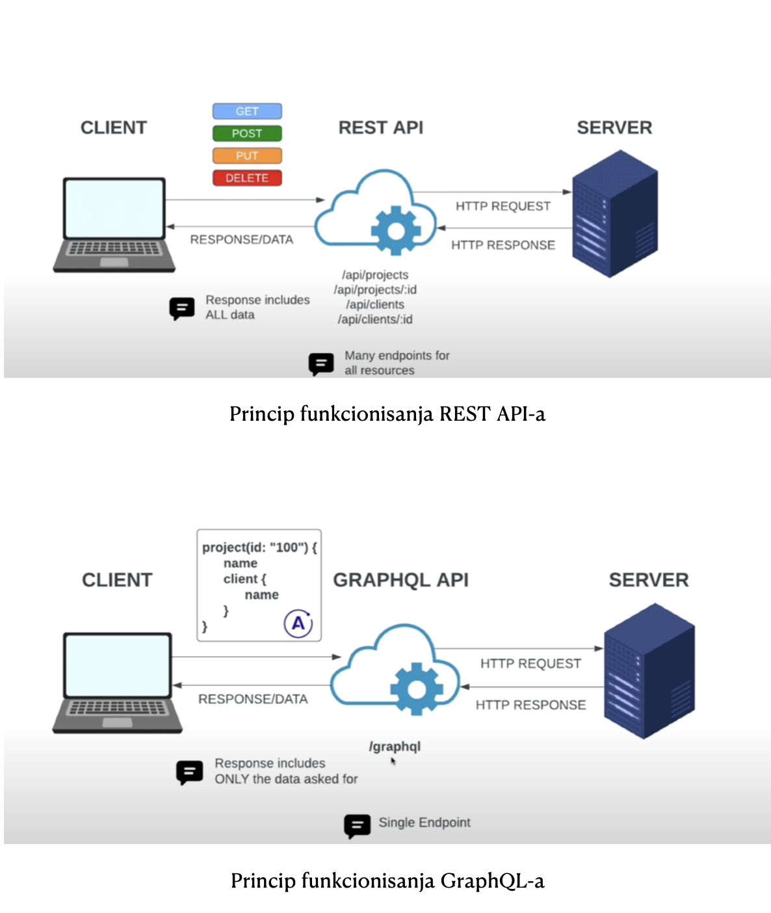
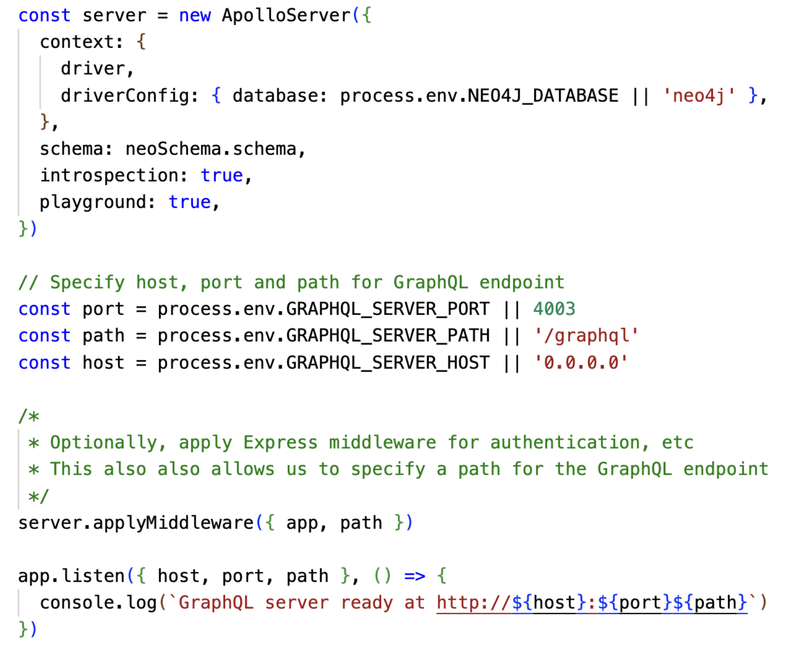
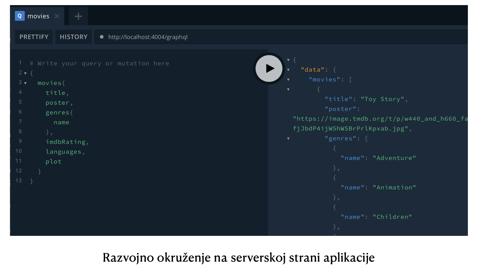

# GRANDstack app for movie recommendation

 

**Šta je GraphQL biblioteke i čemu ona služi?**

Neo4j biblioteka GraphQL je fleksibilna
JavaScript biblioteka otvorenog koda i ona služi za kreiranje,
manipulaciju i kao jezik za upite API-ja. Umjesto da definišu mnoge
krajnje tačke (endpoints) i da podatke vraća svaka od tih krajnjih
tačka, kako radi REST API, GraphQL koristi dobro definisanu šemu i
sistem tipova da bi opisalo koji su nama to tačno podaci potrebni od
API-ja.

Biblioteka GraphQL se može koristiti kombinovati i s raznim relacionim i
nerelacionim bazama podataka, ali u kombinaciji s Neo4j bazom podataka
GraphQL biblioteka olakšava proces kreiranja aplikacije tako što
omogućava da se podaci tretiraju kao graf, od samog početka. Ovim se svi
podaci aplikacije tretiraju kao graf, počevši izvorno od frontend-a pa
sve do skladištenja, čime se izbjegavaju duplikati šema i obezbježuje se
bolja integracija između frontenda i bekenda naše aplikacije.

Kada damo Neo4j GraphQL biblioteci skup definicija
tipova koje opisuju podatke našeg grafa, ona može da generiše cijelu
izvršnu šemu sa svim dodatnim tipovima potrebnim za izvršavanje upita i
mutacija za interakciju sa našom Neo4j bazom podataka. Za svaki upit i
mutaciju nad generisanom šemom, Neo4j GraphQL biblioteka generiše samo
jedan [Cypher](https://neo4j.com/developer/cypher/) upit koji se
izvršava nad našom bazom podataka. Ovo eliminiše poznati [N+1
problem](https://medium.com/the-marcy-lab-school/what-is-the-n-1-problem-in-graphql-dd4921cb3c1a)
koji može da načini GraphQL implementacije spore i neefikasne.

**GraphQL full stack aplikacija**

Za pravljenje Neo4j full stack aplikacije koristimo sljedeće
tehnologije:

-   **GraphQL** - Za pravljenje naših API-a

    **React** - Za izgradnju grafičkog korisničkog interfejsa i
    JavaScript klijentske web aplikacije

    **Apollo** - Alat za rad sa GraphQL, i na serverskoj i na
    klijentskoj strani

    **Neo4j Database** - Baza podataka koju ćemo koristiti za
    skladištenje i manipulaciju naših podataka.

**Definisanje tipova i upiti u GraphQL-u**

Umjesto da budu organizovani oko krajnjih tačaka (endpoints) koje se
mapiraju na resurse (kao kod REST-a), GraphQL API-ji su usredsređeni na
definicije tipova koje definišu tipove podataka, polja i način na koji
su povezani u API-ju. Ove definicije tipa postaju šema API-ja, koji se
opslužuje sa jedne krajnje tačke. Pošto GraphQL usluge mogu da se
implementiraju na bilo kom jeziku, za definisanje GraphQL tipova koristi
se jezički nezavisna GraphQL šema za definisanje jezika.

Mi pravimo jednostavnu aplikaciju za preporučivanje filmova
korisnicima.

Naše definicije GraphQL tipova deklarišu tipove koji se koriste u
API-ju, njihova polja i način na koji su oni povezani. Prilikom
definisanja tipa objekta (kao što je Movie), sva polja dostupna na
objektu i tip svakog polja su takođe navedeni (polja možemo dodati i
kasnije, koristeći ključnu riječ extend). U ovom slučaju definišemo
naslov kao string, za razliku od tipa objekta, koji može da sadrži više
polja i referenci na druge tipove.

Sada smo definisali tipove u GraphQL, ali gdje su nam grafovi?
Ispostavlja se da smo mi zapravo definisali graf koristeći definicije
tipova. Naši objekti su sada čvorovi grafa, a veze između tih čvorova su
veze koje smo naveli u definiciji tipova.

Grafovi se odnose na opisivanje povezanih
podataka, a ovdje smo definisali kako su naši filmovi i glumci povezani
u grafu. GraphQL nam omogućava da modeliramo podatke aplikacije kao graf
i prelazimo preko grafova podataka kroz GraphQL operacije.

GraphQL upiti definišu prolazak kroz graf definisan našim definicijama i
zahtijevaju podskup polja koja će biti vraćena upitom. U našem upitu
počinjemo od ulazne tačke polja upita allMovies i prelazimo kroz graf da
bismo pronašli glumce povezane sa svakim filmom. Zatim, za svakog od
ovih glumaca prolazimo kroz sve ostale filmove s kojima su povezani.

Primijetimo da je naš upit ugniježđen i opisuje kako se prolazi kroz
graf povezanih objekata (u ovom slučaju, filmova i glumaca). Ovo
obilaženje možemo predstaviti preko grafa podataka.

**Detaljnije o aplikaciji**

Kako nam je cilj da napravimo aplikaciju koja komunicira s Neo4j bazom
podataka, mi možemo da koristimo drajver za Neo4j. Klijenski drajveri su
dostupni u mnogo jezika (Java, Python, .Net, JavaScript, Go, itd).

Kako ove podatke unosimo više puta
konekcioni URL, korisničko ime i šifru baze koju koristimo postavimo za
promjenjive okruženja (environment variables) tako što napravimo .env
fajl, definišemo varijable, te ih dalje koristimo u svojoj aplikaciji.

NEO4J_URI=bolt://44.201.146.208:7687

NEO4J_USER=neo4j

NEO4J_PASSWORD=reels-vicinities-quota

Zahtjev pretrage kroz našu full stack GraphQL aplikaciju

Naša aplikacija za filmove ima tri osnovne funkcije:

1.  Prikazuje korisniku sve filmove svih žanrova, te dozvoljava
    korisniku da bira određeni žanr te mu prikazuje samo filmove tog
    žanra.

2.  Izborom određenog filma prikazuje mu detalje o filmu, kao što su
    poster za film, jezik, žanr, trajanje, opis filma i slično.

3.  Prikazuje korisniku listu filmova koji su preporučeni korisniku,
    odnosno listu filmova koji su slični filmu koji je on izabrao.

**Neo4j baza podataka i preporučivanju filmova**

Prije svega, potrebni su nam podaci za našu aplikaciju. Koristimo [Neo4j
Recommendation Sandbox](https://neo4j.com/sandbox/) (besplatnu instancu
Neo4j koja je zasnovana na oblaku), koja sadrži podatke o filmovima,
glumcima i ocjenama filmova.

Grafovska baze podataka se sastoje od čvorova, veza između njih, zatim
oznaka (eng. labels; koje mogu biti oznake čvorova ili oznake veza, s
tim da i čvorovi i veze moju imati više oznaka) i atributa (eng.
properties, koji takođe mogu biti dodijeljeni i čvorovima i vezama).

Movie, Actor, Director, User, Genre su oznake čvorova koje koristimo.

IN_GENRE, DIRECTED, ACTED_IN, RATED su veze koje koristimo.

Title, name, year, rating su neki od atributa koje koristimo.

**Preporuke**

Personalizovane preporuke mogu da pruže bolje iskustvo korisnicima. U
ovoj aplikaciji mi ćemo da generišemo personalizovane preporuke
proizvoda u realnom vremenu zasnovane na grafovima koristeći skup
podataka filmova i ocjena filmova. Generisanje personalizovanih
preporuka je zapravo jedan od najčešćih slučajeva korištenja baze
podataka zasnovanih na grafovima. Neke od glavnih prednosti korištenja
grafova za generisanje preporuka uključuju:

-   Performanse - Susjednost bez indeksa (index-free adjacency)
    omogućava izračunavanje preporuka u realnom vremenu, osiguravajući
    da je preporuka uvijek relevantna i da odražava najnovije
    informacije.

-   Model podataka - Model grafa
    obilježenih svojstava omogućava lako kombinovanje skupova podataka
    iz više izvora. Grafovi na jasan način predstavljaju složene,
    međusobno povezane informacije, kao i odnose unutar njih.
    Modelovanje podataka grafovima je jednostavno i
    efektivno.

**Podešavanje servera za GraphQL**

Definišemo šemu tako što definišemo svaki
od tipova koji koristimo u GraphQL-u i njihove međusobne
veze.

Zatim uvozimo tu šemu, i koristimo env. varijable koje smo prethodno
postavili u .env fajl za pravljenje neo4j drajvera, koji služi za
konekciju sa našom bazom podataka.

Poslije čega na uz pomoć našeg drajvera i šeme pravimo server, tako što
navodimo određeni port na kojom će server da se izvršava. U ovom slučaju
biramo port 4003.

Ukoliko sada pokrenemo server, na linku <http://localhost:4003/graphql>
nam se otvara razvojno okruženje gdje možemo da vidimo definisanu šemu,
odnosno tipove i da izvršavamo GraphQL upite klikom na dugme za oznakom
Play.

**Korištenje GraphQL-a sa React-om**

Na početku je potrebno da uvezemo funkcije
useQuery, gql iz biblioteke \@apollo/client.

Funkcija gql pretvara naš string u upit,
a funkcija useQuery pokreće taj upit i vraća tri informacije. Te
informacije su rezultat izvršavanje upita, informaciju da li se upit još
izvršava i informaciju da li je došlo do greške, i ako jeste vraća
informaciju o vrsti greške.

Sada u zavisnosti od dobijenih podataka, generišemo sadržaj stranice.
Ukoliko se još vrši izvršavanje upita prikazujemo Loading, a ukoliko je
došlo do greške prikazujemo do koje greške je došlo.

Ukoliko se upit izvršio i nije došlo do greške generišemo sadržaj
stranice tako što koristimo varijablu data na kojoj su smješteni svi
filmovi.

**Literatura**

<https://neo4j.com/docs/graphql-manual/current/>

-   <https://graphql.org/learn/>

    <https://blog.grandstack.io/>

    <https://www.npmjs.com/package/@neo4j/graphql>

    <https://www.smashingmagazine.com/2022/11/graph-neo4j-graphql-library/>

    https://github.com/neo4j-graphql/neo4j-graphql-js

    https://github.com/grand-stack/grand-stack-movies-workshop
